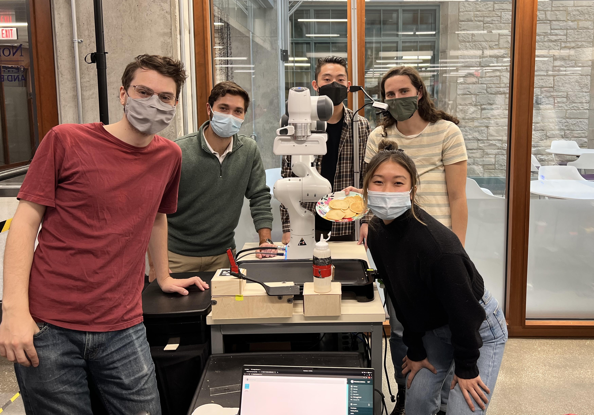

# Team FLIP IT Final Project: Pancake Manipulator Arm
This repository contains software developed for ME 495 Embedded Systems in Robotics course. Written and maintained by James Avtges, Anna Garverick, Jackson Levine, Andru Liu, and Sarah Ziselman. 



## Overview
The objective of this project is to command a Franka Emika Panda arm to pour pre-mixed pancake batter onto a griddle, flip the pancake using a modified spatula, and lift the pancake off the griddle onto a plate. This process is done entirely autonomously utilizing open-source computer vision and motion planning software packages.


The `pancake_pkg` package contains the following nodes:
* `cartesian_control` - This node adjusts the force and torque threshold parameters of the Franka Emika Panda robot by calling the `SetForceTorqueCollisionBehavior` service. This reduces potential reflex that may be exhibited by the robot when planning cartesian paths.
* `pancake_control` - This node is responsible for implementing the `MoveIt` motion planner on the Franka Emika Panda robot. It sends a series of commands to allow for path planning and execution in order to carry out the robot's desired functionality.
* `pancake_vision` - This node is responsible for image processing using data acquired from the RealSense camera. It allows the camera to gain information about the environment such as frame transformations, object poses, and more.

## Software Requirements
The following steps will need to be executed to fulfil the software requirements needed to run this project.

1. Make sure ROS packages are most recent and up-to-date
```
sudo apt update
sudo apt upgrade
```
2. Install pre-requisites packages for the Franka Emika Panda Robot
```
sudo apt install \
     ros-noetic-franka-ros\
     ros-noetic-moveit \
     ros-noetic-moveit-visual-tools \
     ros-noetic-panda-moveit-config
```
3. Add the `panda_moveit_config` package to the custom workspace
```
cd ~/custom_ws/src
git clone https://github.com/ros-planning/panda_moveit_config 
cd panda_moveit_config
git checkout c2eeb1f
cd ~/custom_ws
catkin_make
```
4. Install the RealSense SDK
```
# Install intel's keys
sudo apt-key adv --keyserver keyserver.ubuntu.com \
     --recv-key F6E65AC044F831AC80A06380C8B3A55A6F3EFCDE

# Add the apt repository
sudo add-apt-repository \
     "deb https://librealsense.intel.com/Debian/apt-repo $(lsb_release -cs) main"

# Update the package list
sudo apt update

# Install the packages
sudo apt install librealsense2-dkms librealsense2-utils \
 librealsense2-dev librealsense2-dbg librealsense2-gl-dev \
 ros-noetic-realsense2-camera ros-noetic-realsense2-description

# Install the python wrapper
pip3 install pyrealsense2
```
5. Install MoveIt1
```
sudo apt install ros-noetic-moveit
```
6. Cloning this repository
```
mkdir -p ~/ws/src
cd ws/src
git clone https://github.com/ME495-EmbeddedSystems/final-project-group-5.git
cd ~/ws
catkin_make
source devel/setup.bash
```
Once the following software has been installed, the following packages are ready to be used!

## Hardware Requirements
This project requires the following hardware components:
* RealSense Camera (information on connecting the RealSense can be found [here](https://nu-msr.github.io/me495_site/realsense.html))
* Franka Emika Panda Robot (information on connecting to the Panda can be found [here](https://nu-msr.github.io/me495_site/franka.html))
* Non-stick griddle
* Modified heat-proof spatula
* Pancake Mix with water added
* Food storage bottle

## Usage
First, the hardware must be set up by connecting the RealSense camera (via USB cable) and the Franka Emika Panda arm (via Ethernet cable) to the user's computer and turning on the griddle to 325 degrees Fahrenheit. All april tags and objects must be appropriately placed in the work space. All observers must be outside the boundaries of the robot's workspace.

Once the hardware has been set up, the software is ready to be launched. Open a terminal and navigate to the workspace containing the `pancake_pkg`. Use the following command to launch the project,
```
source devel/setup.bash
roslaunch pancake_pkg make_pancakes.launch use_sim:=false
```
This command will launch the `cartesian_control`, `pancake_control`, `pancake_vision` nodes and display the Franka Emika Panda robot in `MoveIt` using `Rviz`. 

## Configuration
Each of the three main functionalities of the project are implemented through a single ROS service `make_pancakes`. The first step is to pour batter onto the heated griddle. This part of the service will command the robot to grab the food storage bottle containing the mixed pancake batter, flip the bottle spout-side down above the griddle, squeeze the bottle for six seconds allowing for pancake batter to be released, then flip the bottle spout-side up and place it back at its starting location.

Once the batter has been dispensed, the pancake is ready to be flipped to allow for even cooking on both sides. This part of the service will command the robot to grab the modified heat-proof spatula, maneuver it to get the pancake situated on the spatula, flip the pancake back onto the griddle, then move the robot to its home posiiton.

Once the other side of the pancake is fully cooked, the pancake is ready to be handed off to the hungry user. The last part of the service will command the robot to maneuver the modified heat-proof spatula to get the pancake situated on the spatula, then lift it off of the griddle and flip it onto a user's plate.

Open a new terminal and run the following commands
```
cd ~/ws
source devel/setup.bash
rosservice call /make_pancakes
```
Upon successful completion of all the services, the user will have delicious, robot-made pancakes courtesy of the Franka Emika Panda robot and team FLIP IT. 
